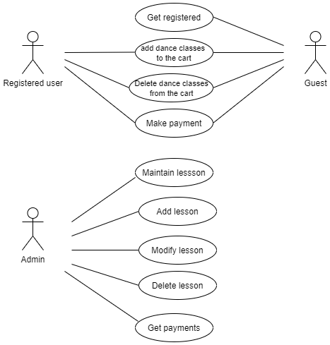
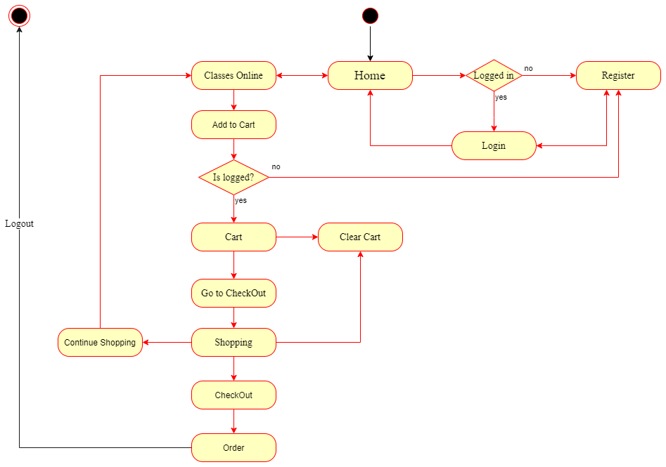
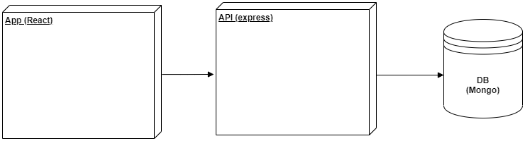
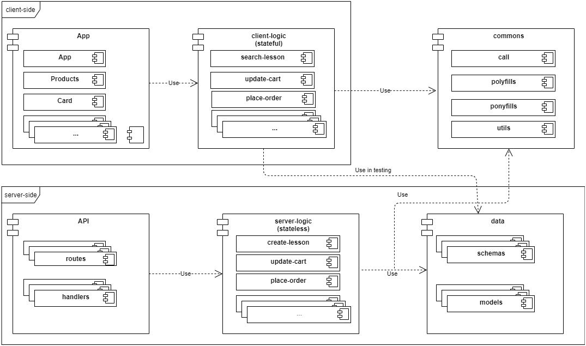
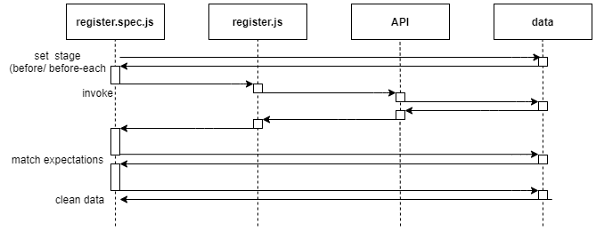
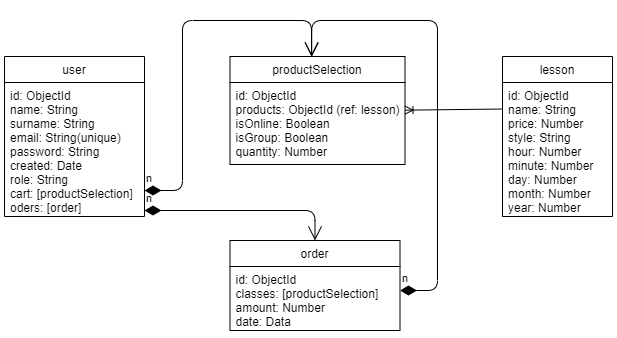
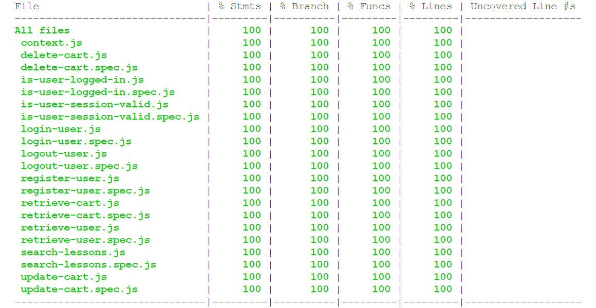
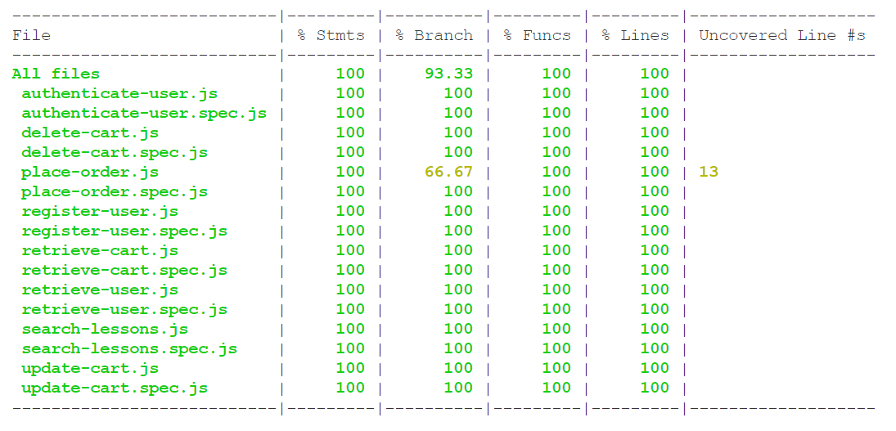

# 7 Potencias


## Description

This is an oficial web site for students and potential customers interested on taking lessons in the dance school **7 Potencias**.

In this web site will be shown all relevant information about the school, like the timetables.

## Functional description

- The dance school **7 Potencias** will have three roles: user, administrator and guest.

- User registration and login.

- Registered users will have access to:

  - Profile.
  - Multimedia.
  - Buy new dance class packages.
  - Renew password and change username.

- The administrator will have access to all the functions of the website.

- The guest user will have access to basic information and make purchases of dance classes.

### Use cases



### Activities



## Technical description

### Blocks



## Modules / Components



## Sequences

Testing



### Data Model



## Code Coverage

Client-side



Server-side



## Instructions

### Server-side

#### Testing

Go to module `server-logic`

```sh
$: npm test
```

#### Code Coverage


```sh
$ npm run test:coverage
```

### Run

Go to module `api`

```sh
$ npm start
```

#### Watching (development only)

```sh
$ npm run watch
```

### Client-side

#### Testing

Go to module `client-logic`

```sh
$ npm test
```

##### Code Coverage

```sh
$ npm run test:coverage
```

### Run

Go to module `app`

```sh
$ npm start
```

#### Enter

```sh
$ open http://localhost:3000/
```

## Link to Trello

[7 Potencias - Trello](https://trello.com/b/89PVF4pr/7-potencias)
